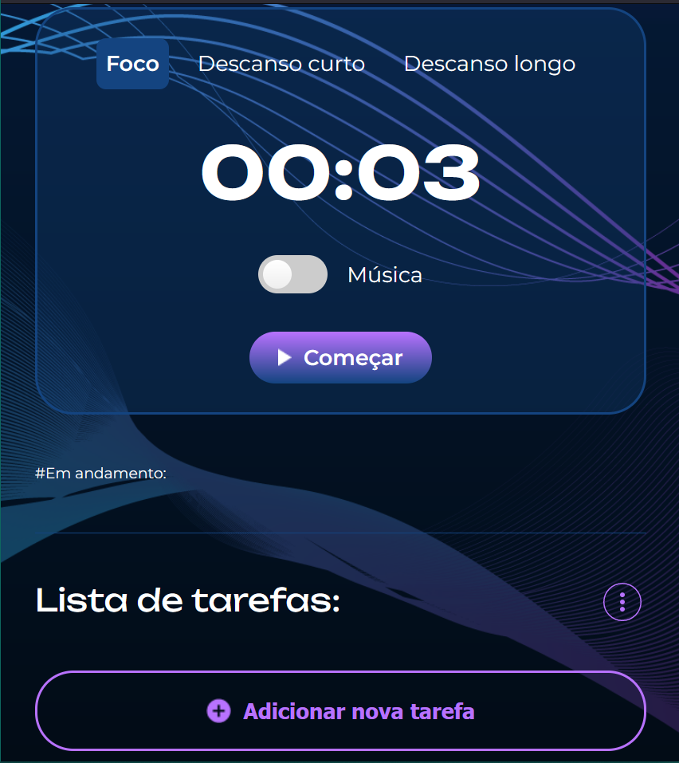
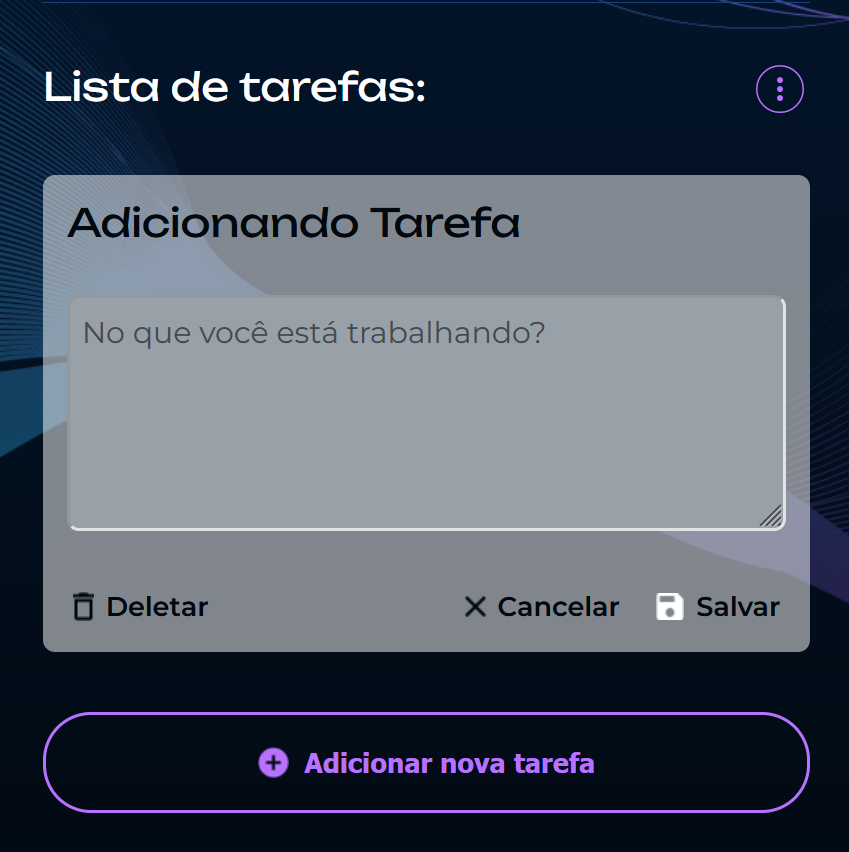
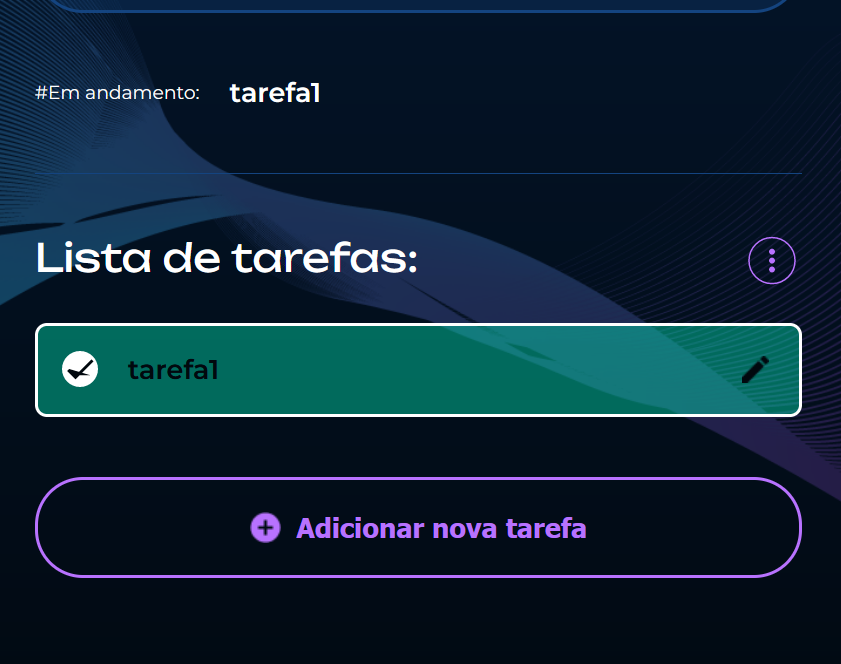

# fokus-alura-localstorage

## Teste a aplicação aqui!
<a href="https://fokus-alura-localstorage.vercel.app">CLIQUE AQUI PARA TESTAR</a>

## Resumo 
Esse foi o projeto usado na aula sobre armazenamento de dados da plataforma de ensino Alura.  
Nesse projeto o usuario consegue adicionar o tempo que se manterar em foco na sua tarefa, com opções de <b>foco, descanso curto e descanso longo</b>. O usuário também consegue adicionar e editar novas tarefas.

## Screenshots

### Assunto Estudado
+ manipulação do DOM
+ localStorage
+ Uso da classList
+ Array

### Redes Social
<a href="https://www.instagram.com/trizzcamp/" ><b>Instagram</b></a>
<a href="https://www.linkedin.com/in/beatriz-campache-27ba1a287/"><b>Linkedin<b></a>

